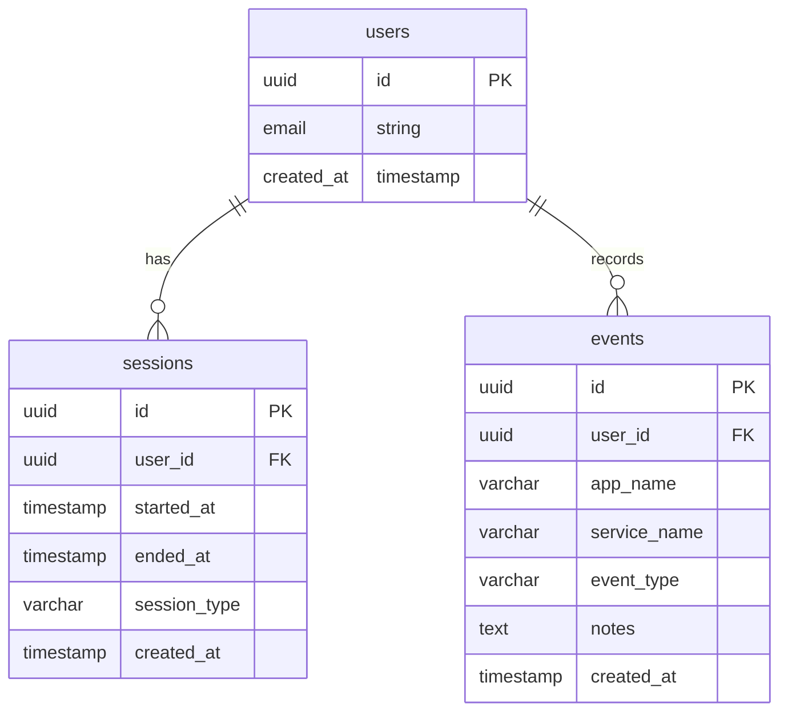

# ActionTracker - 行動分析プラットフォーム

PC上の行動履歴を収集・分析し、「何にどれだけ時間を使ったか」だけでなく、「どのような流れで行動し、なぜ集中や脱線が起きたのか」を可視化する行動理解プラットフォーム。

## ファイル構成

```
action-tracker/
├── index.html              # メインHTMLファイル
├── style.css               # スタイルシート
├── app.js                  # アプリケーションロジック
├── functions/              # Cloudflare Pages Functions
│   └── api/
│       ├── generate-story.js   # Azure AI API連携（ストーリー生成）
│       └── end-session.js      # セッション終了処理
└── README.md              # このファイル
```

---

## データベース構成

### テーブル定義

#### usersテーブル
Supabase Authが自動的に作成するユーザーテーブルを使用します。追加のカラムは必要ありません。

#### sessionsテーブル
ユーザーの作業セッションを管理するテーブル

| カラム名 | 型 | 制約 | 説明 |
|---------|------|------|------|
| id | UUID | PRIMARY KEY | セッションID |
| user_id | UUID | NOT NULL, FOREIGN KEY | ユーザーID（usersテーブルへの外部キー） |
| started_at | TIMESTAMP | NOT NULL | セッション開始時刻 |
| ended_at | TIMESTAMP | NULL | セッション終了時刻 |
| session_type | VARCHAR(20) | NOT NULL | セッションタイプ（focus/break/other） |
| created_at | TIMESTAMP | NOT NULL | レコード作成時刻 |

#### eventsテーブル
ユーザーの行動イベントを記録するテーブル

| カラム名 | 型 | 制約 | 説明 |
|---------|------|------|------|
| id | UUID | PRIMARY KEY | イベントID |
| user_id | UUID | NOT NULL, FOREIGN KEY | ユーザーID（usersテーブルへの外部キー） |
| app_name | VARCHAR(255) | NOT NULL | アプリケーション名 |
| service_name | VARCHAR(255) | NULL | サービス名（任意） |
| event_type | VARCHAR(20) | NOT NULL | イベントタイプ（focus/distraction/break） |
| notes | TEXT | NULL | メモ（任意） |
| created_at | TIMESTAMP | NOT NULL | レコード作成時刻 |

### ER図



### テーブル作成SQL

以下のSQLをSupabaseのSQL Editorに貼り付けて実行してください。

```sql
-- sessionsテーブルの作成
CREATE TABLE IF NOT EXISTS public.sessions (
    id UUID DEFAULT gen_random_uuid() PRIMARY KEY,
    user_id UUID NOT NULL REFERENCES auth.users(id) ON DELETE CASCADE,
    started_at TIMESTAMP WITH TIME ZONE NOT NULL DEFAULT NOW(),
    ended_at TIMESTAMP WITH TIME ZONE,
    session_type VARCHAR(20) NOT NULL DEFAULT 'focus' CHECK (session_type IN ('focus', 'break', 'other')),
    created_at TIMESTAMP WITH TIME ZONE NOT NULL DEFAULT NOW()
);

-- eventsテーブルの作成
CREATE TABLE IF NOT EXISTS public.events (
    id UUID DEFAULT gen_random_uuid() PRIMARY KEY,
    user_id UUID NOT NULL REFERENCES auth.users(id) ON DELETE CASCADE,
    app_name VARCHAR(255) NOT NULL,
    service_name VARCHAR(255),
    event_type VARCHAR(20) NOT NULL DEFAULT 'focus' CHECK (event_type IN ('focus', 'distraction', 'break')),
    notes TEXT,
    created_at TIMESTAMP WITH TIME ZONE NOT NULL DEFAULT NOW()
);

-- インデックスの作成
CREATE INDEX IF NOT EXISTS idx_sessions_user_id ON public.sessions(user_id);
CREATE INDEX IF NOT EXISTS idx_sessions_started_at ON public.sessions(started_at);
CREATE INDEX IF NOT EXISTS idx_events_user_id ON public.events(user_id);
CREATE INDEX IF NOT EXISTS idx_events_created_at ON public.events(created_at);
CREATE INDEX IF NOT EXISTS idx_events_app_name ON public.events(app_name);

-- RLS（Row Level Security）の有効化
ALTER TABLE public.sessions ENABLE ROW LEVEL SECURITY;
ALTER TABLE public.events ENABLE ROW LEVEL SECURITY;

-- RLSポリシー: sessionsテーブル
-- ユーザーは自分のセッションのみ読み取り可能
CREATE POLICY "Users can view own sessions"
    ON public.sessions
    FOR SELECT
    USING (auth.uid() = user_id);

-- ユーザーは自分のセッションのみ挿入可能
CREATE POLICY "Users can insert own sessions"
    ON public.sessions
    FOR INSERT
    WITH CHECK (auth.uid() = user_id);

-- ユーザーは自分のセッションのみ更新可能
CREATE POLICY "Users can update own sessions"
    ON public.sessions
    FOR UPDATE
    USING (auth.uid() = user_id);

-- ユーザーは自分のセッションのみ削除可能
CREATE POLICY "Users can delete own sessions"
    ON public.sessions
    FOR DELETE
    USING (auth.uid() = user_id);

-- RLSポリシー: eventsテーブル
-- ユーザーは自分のイベントのみ読み取り可能
CREATE POLICY "Users can view own events"
    ON public.events
    FOR SELECT
    USING (auth.uid() = user_id);

-- ユーザーは自分のイベントのみ挿入可能
CREATE POLICY "Users can insert own events"
    ON public.events
    FOR INSERT
    WITH CHECK (auth.uid() = user_id);

-- ユーザーは自分のイベントのみ更新可能
CREATE POLICY "Users can update own events"
    ON public.events
    FOR UPDATE
    USING (auth.uid() = user_id);

-- ユーザーは自分のイベントのみ削除可能
CREATE POLICY "Users can delete own events"
    ON public.events
    FOR DELETE
    USING (auth.uid() = user_id);
```

---

## Azure AI API連携

### Cloudflare Pages Functionsの環境変数設定

Cloudflare Pagesのダッシュボードで以下の環境変数を設定してください：

| 環境変数名 | 説明 | 例 |
|-----------|------|------|
| AZURE_OPENAI_ENDPOINT | Azure OpenAI ServiceのエンドポイントURL | https://your-resource.openai.azure.com |
| AZURE_OPENAI_KEY | Azure OpenAI ServiceのAPIキー | your-api-key-here |
| AZURE_OPENAI_DEPLOYMENT | デプロイメント名（オプション、デフォルト: gpt-4） | gpt-4 |
| SUPABASE_URL | SupabaseプロジェクトのURL | https://pgyczjsuuxulyftuuagq.supabase.co |
| SUPABASE_SERVICE_KEY | Supabaseのservice_roleキー（RLSをバイパスするため） | your-service-role-key-here |

### Functionsの仕様

#### `/api/generate-story`
- **メソッド**: POST
- **機能**: 行動データをAzure AI APIに送信し、行動ストーリーを生成
- **リクエストボディ**:
  ```json
  {
    "events": [...],
    "sessions": [...],
    "date": "2024-01-01"
  }
  ```
- **レスポンス**:
  ```json
  {
    "story": "生成されたストーリーテキスト"
  }
  ```

#### `/api/end-session`
- **メソッド**: POST
- **機能**: ページアンロード時にセッションを終了（beacon使用）
- **リクエストボディ**:
  ```json
  {
    "session_id": "uuid",
    "ended_at": "2024-01-01T12:00:00Z"
  }
  ```

---

## デプロイ手順

### Supabaseの設定

#### 1) Supabaseで新規プロジェクトを作成

1. [https://supabase.com](https://supabase.com) にアクセスし、ログインまたは新規登録
2. ダッシュボードの「New Project」をクリック
3. 以下の情報を入力：
   - **Name**: プロジェクト名（例: action-tracker）
   - **Database Password**: 強力なパスワードを設定（必ず記録）
   - **Region**: 最も近いリージョンを選択（例: Northeast Asia (Tokyo)）
4. 「Create new project」をクリック
5. プロジェクトの作成には数分かかります

#### 2) テーブル作成SQLを実行

1. プロジェクト作成完了後、左メニューから「SQL Editor」をクリック
2. 「New query」をクリック
3. 上記の「テーブル作成SQL」セクションにあるSQLをすべてコピーしてエディタに貼り付け
4. 右下の「Run」ボタンをクリックして実行
5. 「Success. No rows returned」と表示されれば成功

#### 3) テーブルの確認

1. 左メニューから「Table Editor」をクリック
2. 以下のテーブルが作成されていることを確認：
   - `sessions`
   - `events`
3. 各テーブルをクリックし、カラムが正しく作成されていることを確認

#### 4) RLSポリシーの確認

1. 左メニューから「Authentication」→「Policies」をクリック
2. `sessions`テーブルと`events`テーブルに以下のポリシーがあることを確認：
   - Users can view own sessions
   - Users can insert own sessions
   - Users can update own sessions
   - Users can delete own sessions
   - Users can view own events
   - Users can insert own events
   - Users can update own events
   - Users can delete own events

#### 5) メール認証の有効化確認

1. 左メニューから「Authentication」→「Providers」をクリック
2. 「Email」プロバイダが有効になっていることを確認
3. 必要に応じて「Google」や「GitHub」も有効にする

Googleを有効にする場合：
1. Googleの「Enable」をクリック
2. Google Cloud ConsoleでOAuthクライアントを作成
3. Client IDとClient SecretをSupabaseに入力
4. 「Save」をクリック

GitHubを有効にする場合：
1. GitHubの「Enable」をクリック
2. GitHubでOAuth Appを作成
3. Client IDとClient SecretをSupabaseに入力
4. 「Save」をクリック

#### 6) APIキーの取得とapp.jsの設定

1. 左メニューから「Project Settings」→「API」をクリック
2. 以下の情報をコピー：
   - **Project URL**: `https://pgyczjsuuxulyftuuagq.supabase.co`
   - **Project API Keys (public/anon)**: `anon`キー
3. `app.js`の先頭にある定数を更新：
   ```javascript
   const SUPABASE_URL = 'https://pgyczjsuuxulyftuuagq.supabase.co';
   const SUPABASE_PUBLISHABLE_KEY = 'your-anon-key-here';
   ```
4. **重要**: `service_role`キーもコピーし、Cloudflare Pages Functionsの環境変数`SUPABASE_SERVICE_KEY`として設定します

---

### Cloudflare Pagesへのデプロイ

#### 方法①: Gitを使わずzipファイルでアップロード

**zipファイルの作成:**

1. 以下の3ファイルを選択：
   - `index.html`
   - `style.css`
   - `app.js`
2. **重要**: ファイルをフォルダに入れず、ファイル自体を直接選択
3. 右クリックして「送信」→「圧縮(zip形式)フォルダー」を選択
4. zipファイルのルート直下に`index.html`が来るようにすること

**Cloudflare Pagesへのアップロード:**

1. [Cloudflare Dashboard](https://dash.cloudflare.com) にログイン
2. 左メニューから「Workers & Pages」をクリック
3. 「Create application」→「Pages」→「Upload assets」をクリック
4. プロジェクト名を入力（例: action-tracker）
5. 作成したzipファイルを選択してアップロード
6. 「Deploy site」をクリック
7. デプロイが完了するとURLが表示されます

**Functionsの追加:**

1. デプロイされたプロジェクトの「Settings」→「Functions」をクリック
2. 「Create directory」をクリックし、`api`と入力
3. 以下のファイルをアップロード：
   - `functions/api/generate-story.js`
最初のzipアップロードには含まれません。別途アップロードする必要があります。

**ファイルを更新する場合:**

1. ファイルを編集
2. 再度3ファイルを選択してzip化
3. Cloudflare Pagesダッシュボードでプロジェクトを選択
4. 「Upload assets」から新しいzipファイルをアップロード

#### 方法②: GitHubリポジトリと連携してデプロイ

**GitHubリポジトリの作成:**

1. [GitHub](https://github.com) にログイン
2. 右上の「+」→「New repository」をクリック
3. リポジトリ名を入力（例: action-tracker）
4. 「Public」または「Private」を選択
5. 「Create repository」をクリック

**ファイルのプッシュ:**

Gitがインストールされている場合：

```bash
cd C:\Users\kkyog\CascadeProjects\action-tracker
git init
git add .
git commit -m "Initial commit"
git branch -M main
git remote add origin https://github.com/your-username/action-tracker.git
git push -u origin main
```

Gitがインストールされていない場合：
1. GitHubリポジトリページで「uploading an existing file」をクリック
2. `index.html`、`style.css`、`app.js`をドラッグ＆ドロップ
3. 「Commit changes」をクリック

**Cloudflare Pagesとの連携:**

1. [Cloudflare Dashboard](https://dash.cloudflare.com) にログイン
2. 左メニューから「Workers & Pages」をクリック
3. 「Create application」→「Pages」→「Connect to Git」をクリック
4. GitHubアカウントを連携（初回のみ）
5. 作成したリポジトリを選択
6. 以下のビルド設定を入力：
   - **Project name**: action-tracker
   - **Production branch**: main
   - **Build command**: （空欄）
   - **Build output directory**: （ルートディレクトリを指定、通常は空欄または「.」）
7. 「Save and Deploy」をクリック

**環境変数の設定:**

1. デプロイされたプロジェクトの「Settings」→「Environment variables」をクリック
2. 「Add variable」をクリックし、以下の環境変数を追加：
   - `AZURE_OPENAI_ENDPOINT`: Azure OpenAIのエンドポイント
   - `AZURE_OPENAI_KEY`: Azure OpenAIのAPIキー
   - `AZURE_OPENAI_DEPLOYMENT`: デプロイメント名（オプション）
   - `SUPABASE_URL`: SupabaseプロジェクトURL
   - `SUPABASE_SERVICE_KEY`: Supabase service_roleキー
3. 「Encrypt」をクリックして保存

**以降の更新:**

GitHubにpushするたびに自動でデプロイが走ります：

```bash
git add .
git commit -m "Update files"
git push
```

---

## 動作確認

### デプロイ後の確認項目

#### 1. ログイン画面の確認
- サイトにアクセスし、ログイン画面が表示されること
- メールアドレスとパスワード入力欄が表示されること
- 「新規登録」リンクが機能すること

#### 2. ユーザー登録の確認
- 「新規登録」をクリックし、メールアドレスとパスワードを入力
- 登録確認メールが届くこと
- メール内のリンクをクリックして認証完了

#### 3. ログインの確認
- 登録したメールアドレスとパスワードでログイン
- ダッシュボード画面が表示されること

#### 4. ダッシュボードの確認
- 統計カード（今日の利用時間、集中時間、脱線回数、現在の状態）が表示されること
- 「セッション開始」ボタンがクリックできること
- セッション開始後、現在の作業状況が更新されること

#### 5. タイムラインの確認
- 「タイムライン」タブをクリック
- 日付を選択して「読み込み」をクリック
- データがある場合、タイムラインが表示されること

#### 6. 行動ストーリーの確認
- 「行動ストーリー」タブをクリック
- 日付を選択して「ストーリー生成」をクリック
- Azure AI APIが設定されている場合、AI生成のストーリーが表示されること
- 設定されていない場合、ローカル生成のシンプルなストーリーが表示されること

#### 7. OAuthログインの確認（設定している場合）
- 「ソーシャルログイン」タブをクリック
- GoogleまたはGitHubボタンをクリック
- OAuthプロバイダのログイン画面が表示されること
- 認証後、ダッシュボードが表示されること

---

## よくあるエラーと対処方法

### 認証エラー

#### エラー: "Invalid login credentials"
**原因**: メールアドレスまたはパスワードが間違っている  
**対処**:
- メールアドレスとパスワードを確認
- 新規登録済みの場合、メール認証が完了しているか確認

#### エラー: "Email not confirmed"
**原因**: メール認証が完了していない  
**対処**:
- 登録時のメールを確認し、認証リンクをクリック
- メールが届かない場合、Supabaseダッシュボードの「Authentication」→「Users」から手動で確認可能

### RLSによるデータ取得失敗

#### エラー: "Permission denied"
**原因**: RLSポリシーが正しく設定されていない  
**対処**:
1. Supabaseダッシュボードの「Authentication」→「Policies」を確認
2. すべてのポリシーが有効になっていることを確認
3. SQL EditorでRLSポリシーを再実行

#### エラー: "JWT expired"
**原因**: セッションが切れている  
**対処**:
- ログアウトして再ログイン

### Azure APIキー未設定

#### エラー: "Azure AI API configuration is missing"
**原因**: Cloudflare Pages Functionsの環境変数が設定されていない  
**対処**:
1. Cloudflare Pagesダッシュボードでプロジェクトを選択
2. 「Settings」→「Environment variables」を確認
3. 必要な環境変数（AZURE_OPENAI_ENDPOINT, AZURE_OPENAI_KEY）を設定

#### エラー: "Azure OpenAI API error: 401"
**原因**: APIキーが無効または期限切れ  
**対処**:
- Azure PortalでAPIキーを再生成
- Cloudflare Pages Functionsの環境変数を更新

### CORSエラー

#### エラー: "CORS policy: No 'Access-Control-Allow-Origin' header"
**原因**: SupabaseまたはAzure AI APIのCORS設定  
**対処**:
- Supabase: ダッシュボードの「Project Settings」→「API」→「CORS」にドメインを追加
- Azure AI: Azure PortalでCORS設定を確認

### Cloudflare Pages Functionsのエラー

#### エラー: "404 Not Found" on /api/generate-story
**原因**: Functionsが正しくデプロイされていない  
**対処**:
1. `functions/api/generate-story.js`が存在することを確認
2. Cloudflare PagesダッシュボードでFunctionsがデプロイされていることを確認
3. 必要に応じて再デプロイ

#### エラー: "500 Internal Server Error"
**原因**: Functions内でエラーが発生  
**対処**:
1. Cloudflare Pagesダッシュボードの「Functions」→「Logs」でエラー詳細を確認
2. 環境変数が正しく設定されているか確認
3. Functionsのコードを確認

### その他のエラー

#### エラー: "Network Error"
**原因**: インターネット接続またはAPIエンドポイントの問題  
**対処**:
- インターネット接続を確認
- Supabase URLとAzure AI Endpointが正しいか確認

#### エラー: "Storage quota exceeded"
**原因**: Supabaseのストレージ容量超過  
**対処**:
- Supabaseダッシュボードでストレージ使用量を確認
- 必要に応じてプランをアップグレード

---

## 技術仕様

### フロントエンド
- HTML5, CSS3, Vanilla JavaScript
- Supabase JS Client v2（CDN経由）
- レスポンシブデザイン（モバイル対応）

### バックエンド
- Supabase（PostgreSQL）
- Row Level Security（RLS）によるデータアクセス制御
- Supabase Authによるユーザー認証

### AI機能
- Azure OpenAI Service（GPT-4）
- Cloudflare Pages Functions経由でAPI呼び出し
- APIキーは環境変数で管理（クライアントには露出しない）

### ホスティング
- Cloudflare Pages
- 静的サイト + Functions

---

## ライセンス

このプロジェクトはMITライセンスの下で提供されています。

---

## サポート

問題がある場合は、以下を確認してください：
1. このREADMEの「よくあるエラーと対処方法」セクション
2. Supabaseドキュメント: https://supabase.com/docs
3. Cloudflare Pagesドキュメント: https://developers.cloudflare.com/pages
4. Azure OpenAIドキュメント: https://docs.microsoft.com/azure/cognitive-services/openai
